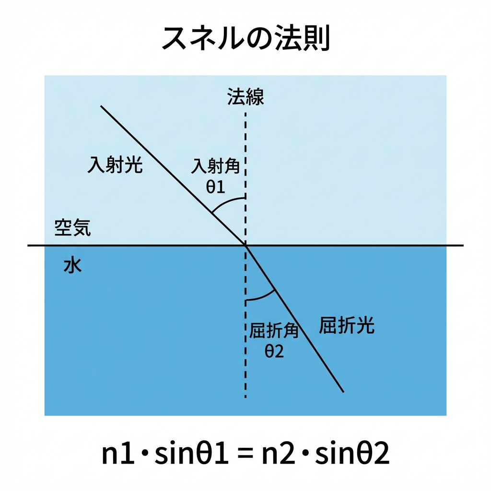
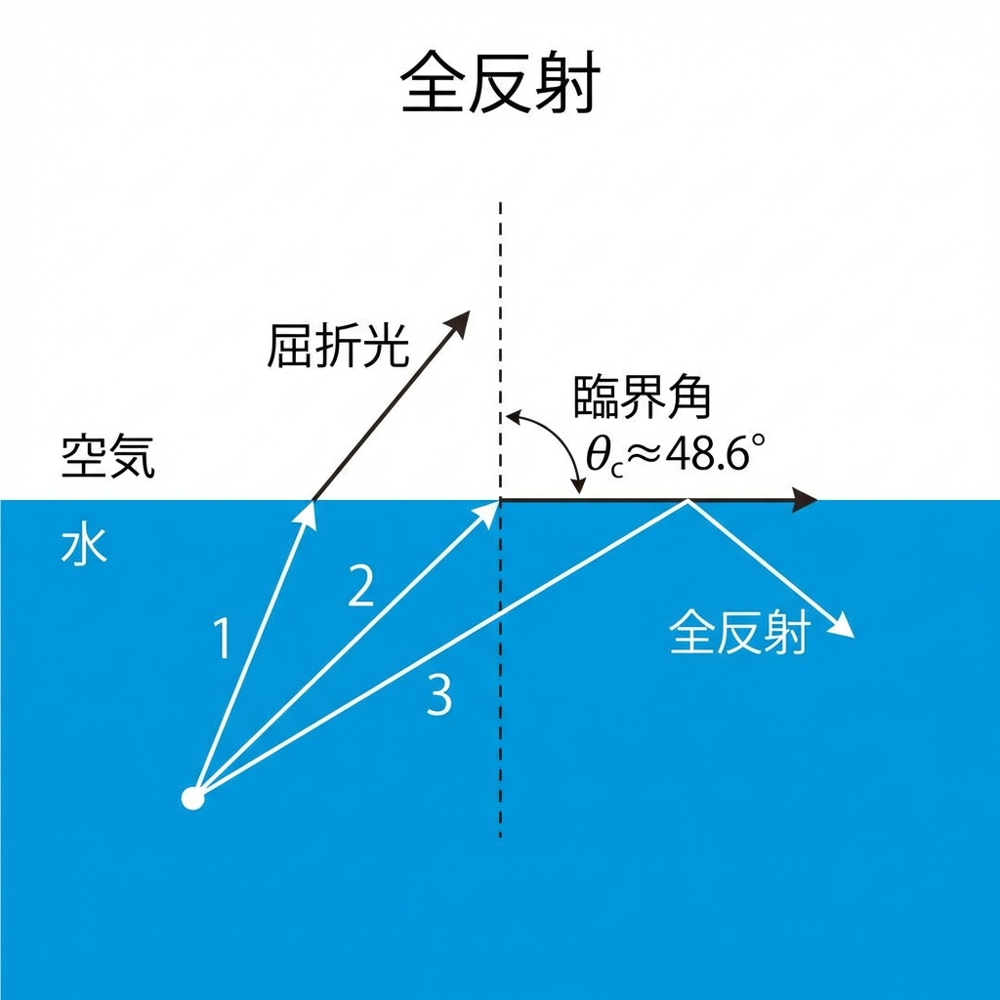
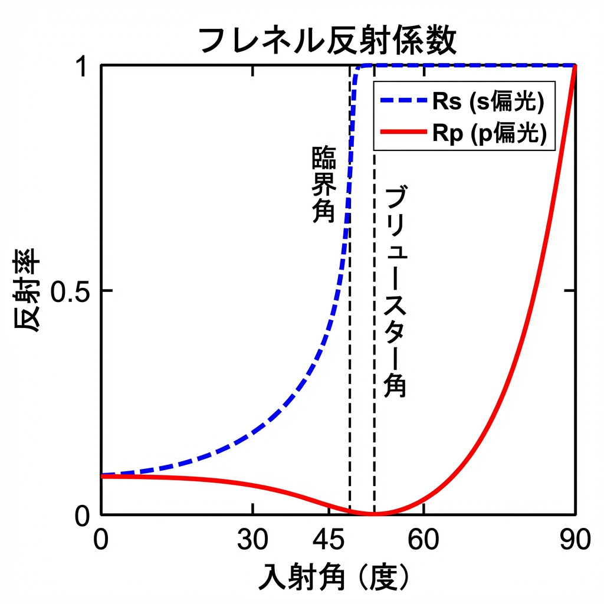
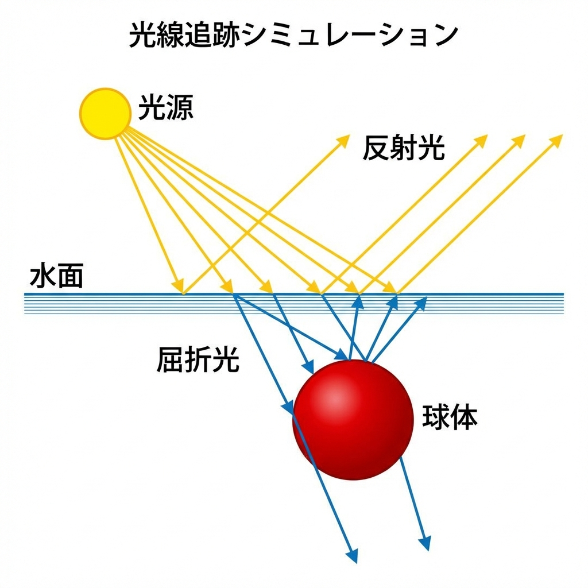
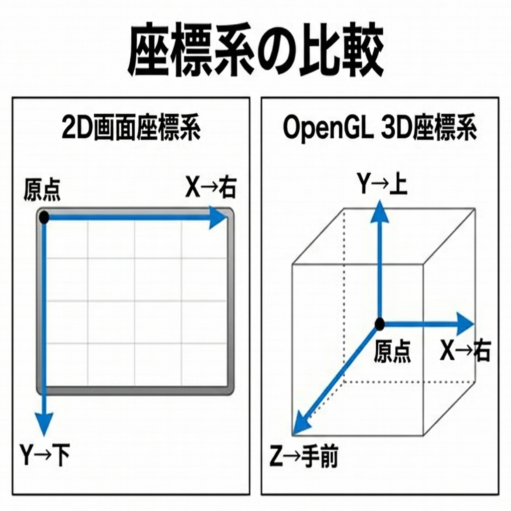
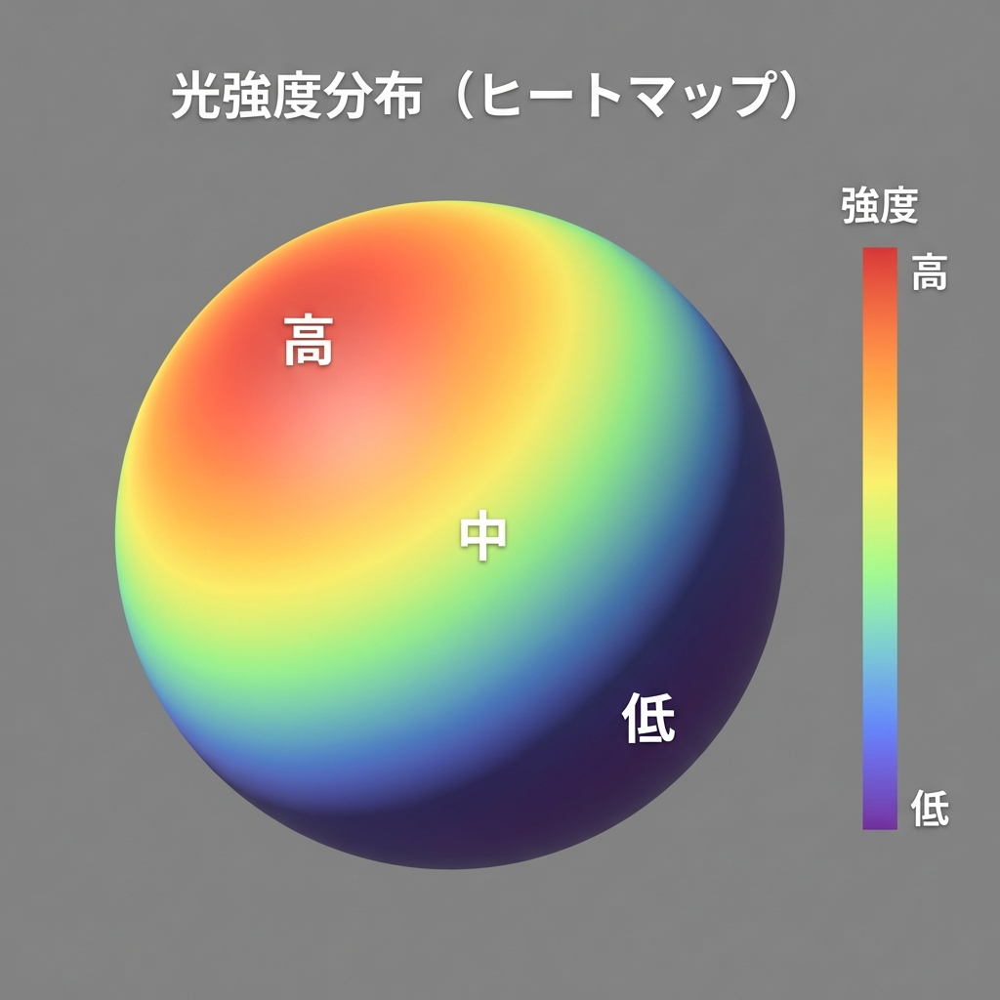

# 光学シミュレーション OptSim2
## プレゼンテーション資料

---

# 1. プロジェクト概要

## 目的
水中に沈んだ球体に光が当たる様子をシミュレーションし、光の屈折・反射を視覚化するアプリケーション。

## 主な機能
- 2D/3D 両方のビューで光線をシミュレーション
- 光源の角度・広がり・強度の調整
- 水面の屈折率・波紋効果の設定
- 球体のヒートマップ表示

---

# 2. 幾何光学の基礎

## 2.1 スネルの法則 (Snell's Law)

光が異なる媒質の境界面を通過するとき、入射角と屈折角の関係を表す法則。



### 数式
$$n_1 \sin\theta_1 = n_2 \sin\theta_2$$

- $n_1$ : 入射側の屈折率（空気 ≈ 1.0）
- $n_2$ : 屈折側の屈折率（水 ≈ 1.33）
- $\theta_1$ : 入射角
- $\theta_2$ : 屈折角

### コード実装
```python
# 屈折角の計算
sin_theta2 = (n1 / n2) * sin(theta1)
if abs(sin_theta2) <= 1:
    theta2 = arcsin(sin_theta2)  # 屈折
else:
    # 全反射
```

---

## 2.2 全反射 (Total Internal Reflection)

光が密な媒質（水）から疎な媒質（空気）へ進むとき、入射角が臨界角を超えると全反射が起こる。



### 臨界角の計算
$$\theta_c = \arcsin\left(\frac{n_2}{n_1}\right)$$

水から空気への臨界角: $\theta_c \approx 48.6°$

---

## 2.3 フレネルの式 (Fresnel Equations)

境界面での反射率と透過率を計算する式。



### s偏光（垂直偏光）
$$R_s = \left|\frac{n_1\cos\theta_1 - n_2\cos\theta_2}{n_1\cos\theta_1 + n_2\cos\theta_2}\right|^2$$

### p偏光（平行偏光）
$$R_p = \left|\frac{n_2\cos\theta_1 - n_1\cos\theta_2}{n_2\cos\theta_1 + n_1\cos\theta_2}\right|^2$$

### 実装での簡略化
```python
# 無偏光の平均反射率
R = (Rs + Rp) / 2
T = 1 - R  # 透過率
```

---

# 3. 光線追跡アルゴリズム

## 3.1 基本的な流れ



1. **光源から光線を生成**
   - 位置、方向、強度を設定

2. **媒質境界との交点を検出**
   - 水面（平面）との交点
   - 球体との交点

3. **屈折・反射の計算**
   - スネルの法則で新しい方向を計算
   - フレネル式で反射/透過の割合を決定

4. **光線の経路を記録**
   - 各交点を経由点として保存

---

## 3.2 球体との交差判定

光線と球体の交点を求める二次方程式：

$$t^2(\vec{d} \cdot \vec{d}) + 2t(\vec{d} \cdot \vec{o}) + (\vec{o} \cdot \vec{o} - r^2) = 0$$

- $\vec{d}$ : 光線の方向ベクトル
- $\vec{o}$ : 光線の始点から球の中心へのベクトル
- $r$ : 球の半径

### 判別式
$$D = b^2 - 4ac$$

- $D > 0$ : 2点で交差
- $D = 0$ : 接する
- $D < 0$ : 交差しない

---

# 4. シミュレーションの実装

## 4.1 座標系



| 座標系 | X軸 | Y軸 | Z軸 |
|--------|-----|-----|-----|
| 2D画面 | 右 | 下 | - |
| OpenGL 3D | 右 | 上 | 手前 |

## 4.2 水面の表現

```python
# 水面の高さ（画面の中央付近）
water_level = view_height * 0.5

# 波紋効果（sin波で水面を揺らす）
wave_offset = amplitude * sin(frequency * x + phase)
```

---

## 4.3 光源パラメータ

| パラメータ | 説明 | 範囲 |
|-----------|------|------|
| 角度 | 光線の入射角度 | -90° 〜 +90° |
| 広がり | 光線の扇形角度 | 0° 〜 180° |
| 強度 | 光の明るさ | 0.0 〜 2.0 |
| 本数 | 光線の数 | 1 〜 100 |
| 間隔 | 複数光源の間隔 | mm単位 |

---

# 5. 3D描画技術

## 5.1 OpenGLによるレンダリング

- **深度テスト**: 前後関係の正しい描画
- **ライティング**: 光源による陰影
- **透明度**: 水面のブレンディング

## 5.2 球体の描画

緯度経度方式で球体を分割：
```python
for lat in range(-90, 90, step):  # 緯度
    for lng in range(0, 360, step):  # 経度
        x = cos(lat) * cos(lng)
        y = cos(lat) * sin(lng)
        z = sin(lat)
```

---

# 6. ヒートマップ表示

## 目的
球体表面に当たる光の強さを色で可視化。



## カラーマップ
| 強度 | 色 |
|------|-----|
| 高 | 赤 🔴 |
| 中 | 黄〜緑 🟡🟢 |
| 低 | 青 🔵 |

## 計算方法
各表面セグメントに当たる光線の数をカウントし、最大値で正規化。

---

# 7. UIコンポーネント

## スライダー
- ドラッグによる連続値調整
- テキスト入力による直接値指定
- 点滅カーソル、矢印キー対応

## ボタン
- 視点切り替え（Front, Back, Top, etc.）
- プロファイルモード ON/OFF
- 軸切り替え（X/Y）

---

# 8. 物理定数

| 物質 | 屈折率 n |
|------|----------|
| 真空 | 1.0000 |
| 空気 | 1.0003 |
| 水 | 1.333 |
| ガラス | 1.5 |
| ダイヤモンド | 2.42 |

---

# 9. 参考文献

1. **Hecht, E.** "Optics" (光学の教科書)
2. **Shirley, P.** "Ray Tracing in One Weekend" (レイトレーシング入門)
3. **OpenGL Programming Guide** (OpenGL公式ガイド)

---

# 10. 今後の課題

- [ ] ヒートマップと自然光シェーディングの一致
- [ ] 波動光学（回折・干渉）の実装
- [ ] より高精度なフレネル反射
- [ ] GPU加速による高速化
